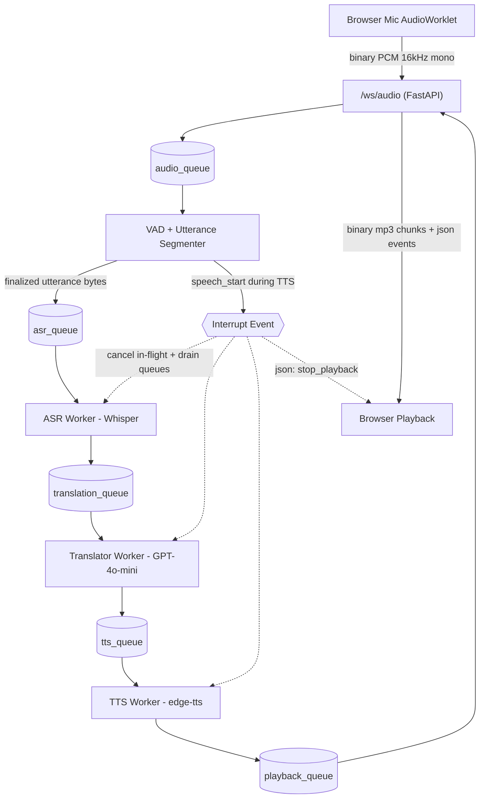

# Real-Time English → Hindi Voice Translator

A streaming voice-to-voice translation pipeline. The browser captures
microphone audio, the FastAPI backend slices it into utterances with VAD,
sends each utterance to OpenAI Whisper for transcription, translates the
English to Hindi via `gpt-4o-mini`, and streams Hindi MP3 audio back via
Edge TTS — all over a single WebSocket.

The focus of this project is **backend systems thinking**: queue-based
pipeline orchestration, partial-transcript stabilization, low-latency
streaming, and clean cancellation when the user interrupts.

---

## Quick start

```bash
git clone https://github.com/akhilmedvolt/rt-v2v.git && cd rt-v2v

python3 -m venv .venv
source .venv/bin/activate
pip install -r requirements.txt

cp .env.example .env
# edit .env and set OPENAI_API_KEY=sk-...

uvicorn backend.app:app --port 8000
# open http://localhost:8000 in Chrome/Edge/Firefox
```

Click **Start recording**, speak in English, pause for half a second, and you
should hear a Hindi translation a moment later. Click **Stop** when done.

> Tested with Python 3.11–3.13 on macOS. The browser client expects a 16 kHz
> `AudioContext`; Chrome, Edge, and Firefox honor that. Safari can fall back
> to its native sample rate, which may cause the server-side VAD to misbehave —
> use Chrome for the demo.

---

## Architecture



Every WebSocket connection gets its own `Session` that owns five bounded
`asyncio.Queue`s and four worker tasks (ASR, translator, TTS, playback
dispatcher). Nothing is shared across connections, so cancellation and state
remain local.

---

## Project layout

```
backend/
  app.py             FastAPI app + /ws/audio endpoint + static mount
  session.py         Session: queues, workers, interrupt protocol, latency
  vad.py             webrtcvad-based utterance segmenter
  messages.py        Dataclasses that flow between queues
  prompts.py         Translation system prompt + few-shots
  config.py          Env loading + tunables
  workers/
    asr.py           Whisper API per-utterance + interrupt race
    translator.py    gpt-4o-mini chat completion per utterance
    tts.py           edge-tts streaming MP3 producer
frontend/
  index.html         Minimal UI (Start/Stop, transcripts, latency)
  app.js             WS client, MediaSource playback
  pcm-worklet.js     AudioWorklet: Float32 -> Int16
requirements.txt
.env.example
```

---

## Design decisions

### Why VAD-segmented Whisper instead of "streaming ASR"

OpenAI Whisper is not a true streaming API. Naively forwarding every audio
chunk produces the classic partial-transcript instability called out in the
brief (`"hello"`, `"hello can"`, `"hello can we"` …), which would force the
translator and TTS to redo work on every frame.

Instead, [`backend/vad.py`](backend/vad.py) runs `webrtcvad` over 20 ms PCM
frames and emits an utterance only after `VAD_SILENCE_MS` of trailing
silence. The silent gap is a strong natural stabilization signal — it
matches how a human listener decides "the sentence is done". Each finalized
utterance carries ~200 ms of pre-speech padding so the leading consonant is
never clipped, and bursts shorter than `VAD_MIN_SPEECH_MS` (clicks, throat
clears) are dropped.

### Queue design

All five queues are bounded with a deliberately conservative `maxsize`. On
overflow, [`Session.offer`](backend/session.py) **drops the oldest item**
rather than blocking the producer. In a real-time translator, latency
matters more than completeness: if the queue is full it almost always means
the user has moved on, and we would rather discard stale work than fall
further behind.

The `audio_queue` between WS and VAD is omitted in practice — VAD is fast
enough to run inline in the WS receive loop, so we avoid the extra queue
hop and its latency. The other four queues each decouple stages and isolate
backpressure.

### Interruption protocol

The brief flags interruption handling as "important". When the VAD emits a
`SpeechStart` event while any downstream queue still has work
([`_session_is_active`](backend/app.py)), [`Session.interrupt`](backend/session.py)
runs the following sequence atomically:

1. Bump `current_gen` so every in-flight `UtteranceItem`, `TranscriptItem`,
   `TranslationItem`, and `PlaybackItem` becomes **stale**. Workers cheaply
   skip stale items at the top of their loop.
2. Set the `interrupt_event`. Workers that are blocked inside an `await`
   on Whisper or GPT-4o-mini are wrapped in
   [`_race_interrupt`](backend/workers/asr.py), which cancels the API task
   as soon as the event fires.
3. Drain `translation_queue`, `tts_queue`, and `playback_queue` so no stale
   audio gets to the client.
4. Send `{"type": "stop_playback"}` to the client, which tears down its
   `MediaSource` and creates a fresh one — flushing any buffered MP3 still
   in the audio element.
5. Clear `interrupt_event` so the next utterance proceeds normally.

The combination of (generation tags) + (cancellable awaits) + (queue drain)
+ (client flush) handles the full spectrum of where an utterance can be in
the pipeline when the user starts speaking again.

### Streaming TTS

`edge-tts` natively streams MP3 chunks as synthesis runs, which keeps
`tts_first_chunk_ms` low — the user hears the first syllable while the
backend is still synthesizing the tail. The browser consumes those chunks
with the `MediaSource` API (`audio/mpeg`) so playback starts as soon as
the first chunk lands.

### Wire format

The browser sends **Int16 little-endian PCM, mono, 16 kHz** over the
WebSocket (matching what `webrtcvad` expects), and the server streams
**MP3** back (edge-tts native format, decoded directly by the `<audio>`
element). No `ffmpeg` dependency, no Opus container parsing.

### Translation prompt

See [`backend/prompts.py`](backend/prompts.py). The system prompt enforces:

* Output **only** the Hindi translation, no preamble or quotes.
* Preserve named entities (Google Meet, Asterisk, Kubernetes, ETA, AWS,
  GitHub, OpenAI, …) **verbatim in Latin script**.
* Drop or soften fillers ("uh", "um", "you know", "like", "I mean", …).
* Localize numbers, dates, and times naturally
  (`5 PM tomorrow` → `कल शाम 5 बजे`).
* Match source tone (formal vs. casual).
* Return an **empty string** for pure-filler / untranslatable input. The
  TTS worker treats empty translations as a no-op so we don't synthesize
  silence.

Few-shot examples anchor the model on the canonical "meeting at 5 PM" case
and on named-entity preservation.

---

## Edge cases mapped to implementation

| Brief edge case | Where it's handled |
| --- | --- |
| Strong accents / fast speech | `VAD_SILENCE_MS=500` gives Whisper a complete utterance; Whisper handles accents natively. Adjust via `.env`. |
| Partial streaming inputs | VAD-based utterance segmentation — no translation until end of utterance. |
| Fillers ("uh", "you know", …) | `TRANSLATION_SYSTEM_PROMPT` in [`prompts.py`](backend/prompts.py) + empty-translation skip in TTS worker. |
| Named entities ("Google Meet", "Asterisk") | Explicit instruction + Latin-script examples in `FEW_SHOT_EXAMPLES`. |
| Numbers / dates / abbreviations | Prompt rule #4 + few-shot for "5 PM tomorrow". |
| Tone (formal vs. casual) | Prompt rule #5. |
| Latency build-up | All queues bounded with drop-oldest in [`Session.offer`](backend/session.py); `gen` tags drop stale work without canceling worker tasks. |
| User interruption during TTS | [`Session.interrupt`](backend/session.py) — full protocol described above. |

---

## Latency

The pipeline reports per-stage timings as a `latency` event on first MP3
chunk. Logged server-side too. Rough numbers on a local Mac with good
network:

| Stage | Typical |
| --- | --- |
| ASR (Whisper API, ~1 s utterance) | 350–600 ms |
| Translation (`gpt-4o-mini`) | 200–400 ms |
| TTS first chunk (edge-tts) | 250–500 ms |
| **Total (utterance end → first Hindi audio)** | **~1.0–1.5 s** |

This is well within the brief's ~1–2 s target. The dominant levers are
`VAD_SILENCE_MS` (lower = faster but more false finalizations) and the
ASR/translator round trips themselves.

---

## Configuration

All knobs live in [`.env.example`](.env.example):

| Var | Default | Notes |
| --- | --- | --- |
| `OPENAI_API_KEY` | _(required)_ | Used for Whisper + chat completions |
| `ASR_MODEL` | `whisper-1` | OpenAI ASR model |
| `TRANSLATOR_MODEL` | `gpt-4o-mini` | Cheap + accurate enough for short utterances |
| `TTS_VOICE` | `hi-IN-MadhurNeural` | Try `hi-IN-SwaraNeural` for a female voice |
| `SAMPLE_RATE` | `16000` | Must be 8/16/32/48 kHz (webrtcvad constraint) |
| `VAD_AGGRESSIVENESS` | `2` | 0 (lenient) – 3 (strict) |
| `VAD_SILENCE_MS` | `500` | Trailing silence required to finalize an utterance |
| `VAD_MIN_SPEECH_MS` | `300` | Discards shorter bursts as noise |
| `*_QUEUE_MAX` | see file | Bounded queue sizes (drop-oldest on overflow) |
| `LOG_LEVEL` | `INFO` | `DEBUG` exposes queue/eviction details |

---

## WebSocket protocol

`ws://<host>/ws/audio`

Client → server:

* Binary frame: Int16 LE PCM, 16 kHz mono, any length.
* `{"type": "start"}` — reset segmenter + interrupt any in-flight turn.
* `{"type": "stop"}` — best-effort end-of-stream marker.

Server → client:

* Binary frame: MP3 chunk for playback.
* `{"type": "ready", "sample_rate": 16000, "voice": ...}`
* `{"type": "partial_transcript", "text": ..., "asr_ms": ...}`
* `{"type": "translation", "english": ..., "hindi": ..., "translate_ms": ...}`
* `{"type": "latency", "asr_ms": ..., "translate_ms": ..., "tts_first_chunk_ms": ..., "total_ms": ...}`
* `{"type": "stop_playback", "reason": ...}` — client must flush its
  `MediaSource`.
* `{"type": "error", "stage": ..., "message": ...}`

---

## Future improvements

Things deliberately out of scope for this assessment but worth doing in a
production system:

* **Streaming ASR**: Gemini Realtime / Whisper-streaming style "partial +
  final" transcripts, eliminating the VAD-silence wait.
* **VAD upgrade**: replace `webrtcvad` with `silero-vad` for better
  accent and noise robustness.
* **Adaptive buffering**: dynamically widen `VAD_SILENCE_MS` for fast
  speakers and shorten it for slow speakers.
* **Streaming translation**: stream tokens from GPT-4o-mini into a
  sentence-boundary detector and start TTS on each clause.
* **Smarter named-entity preservation**: extract entities with a small
  classifier and mask them as placeholder tokens before translation, then
  splice back — more robust than relying on prompt fidelity.
* **Speaker diarization**: separate the user from other voices on the
  microphone.
* **Multilingual switching**: detect source language and route to the
  right ASR / translation pair.
* **Local model inference**: `faster-whisper` + `IndicTrans2` + a local
  Hindi TTS for zero-API-cost operation.
* **Observability**: structured tracing per turn (OpenTelemetry), p50/p95
  latency dashboards.

---

## Notes for reviewers

The brief explicitly said to avoid spending time on auth, deployment infra,
Kubernetes, databases, monitoring stacks, and UI polish — so this
repository deliberately does not include them. Everything you need to run
the demo is in this README and `.env.example`.
